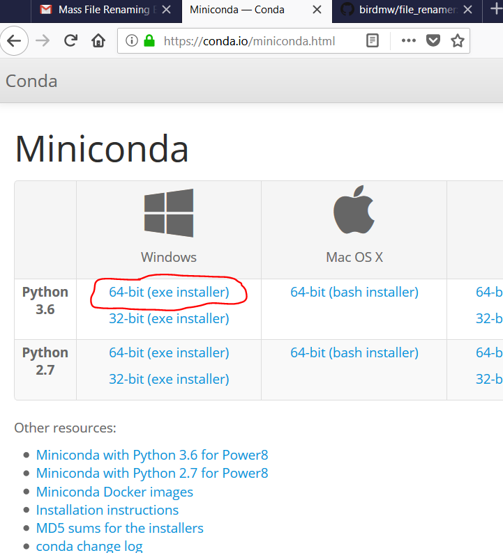
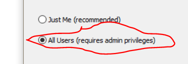
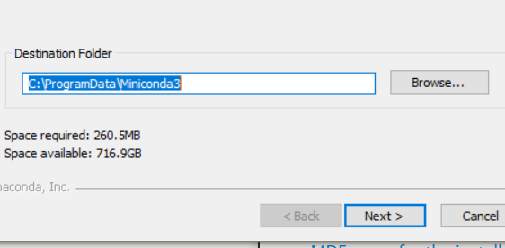
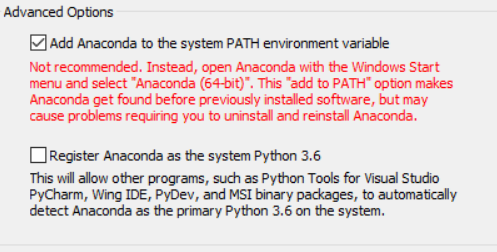
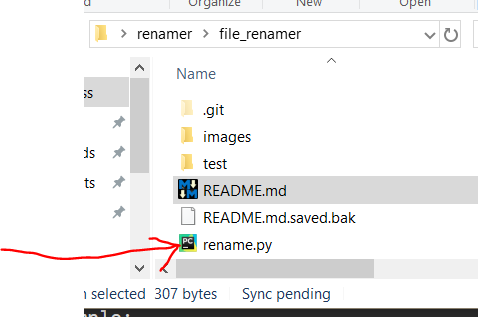
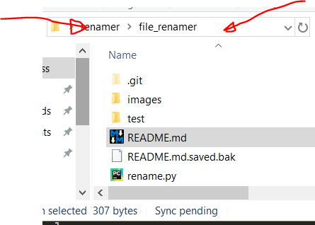
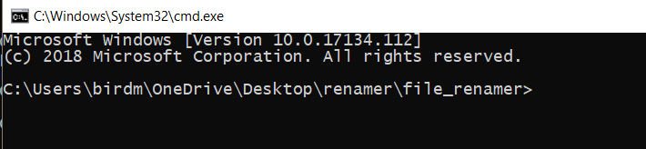
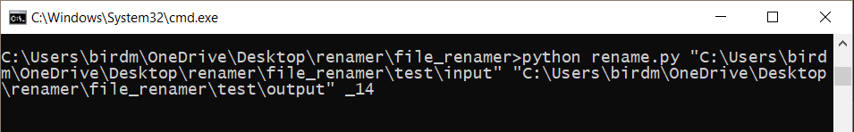

# file_renamer
small project for friend to rename files

============

============

============

You can also select "Register Anaconda as system Python 3.6" - in fact I suggest doing this

============

After Miniconda is installed, You are going to download this utility from this website https://github.com/birdmw/file_renamer by clicking the green "Clone or download" button. Remember where you save it and unzip it.

============

Now, to use the tool, you need 3 things:
1 - a source directory
2 - a destination directory (remember to create one!)
3 - what you what to append to the filename

example:

C:\my_source\dir\
C:\my_destination\directory\
_5

If there are any spaces in your filenames then put quotes around the whole thing like this "C:\my destination\directory\"

============

Navigate to the folder where you downloaded rename.py

Then you will type right into the address bar the letters "cmd" and press enter

this will spawn a command prompt at the location of rename.py

============

now it's as simple as providing the parameters above

Here is a simple example:
`python rename.py C:\my_source\dir\ C:\my_destination\directory\ _5`

here is a realistic example:

============

That's it!